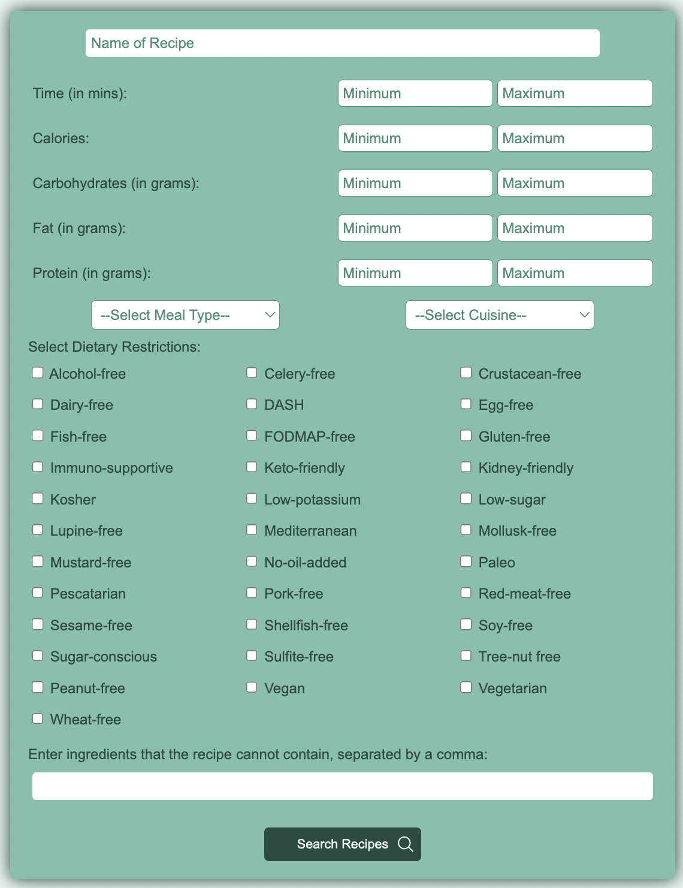
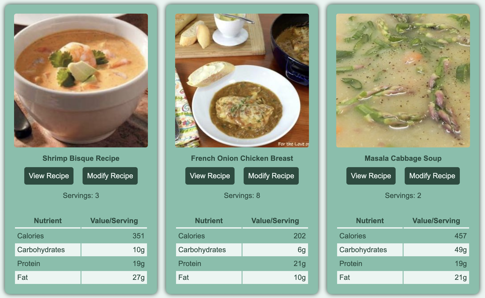
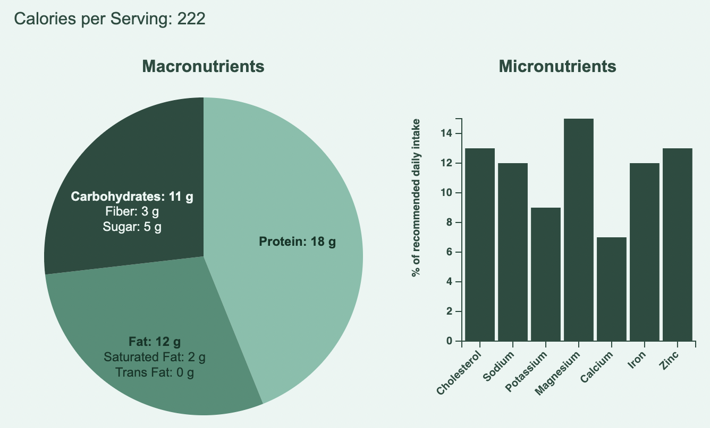
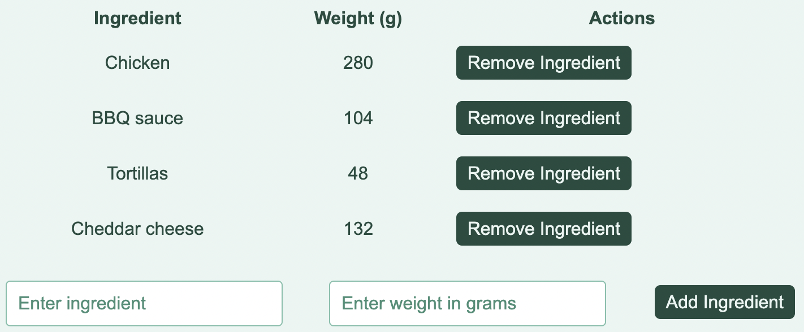

# [ModularMeals](https://stefanlazarevic97.github.io/modular-meals/)

Empowering personalized culinary creativity with over 1.7 million recipes tailored to your dietary needs and preferences.

## Description

If you've found yourself pressed for time with just 45 minutes to prepare dinner, or tasked with crafting a high-protein, low-carb, dairy-free, vegetarian breakfast, our application is the ideal solution for you. Perhaps you're looking to dazzle your friends with a culinary masterpiece hailing from their homeland, or maybe you're facing the challenge of missing an essential ingredient from a recipe. Even if your ambition is to recreate healthier versions of your favourite comfort foods, or to cleverly utilise those extra ingredients lying idle in your pantry, this application will empower you in your gastronomical endeavours.

Leveraging the extensive database of [Edamam's Recipe API](https://developer.edamam.com/edamam-recipe-api), this application offers you the ability to search across 1.7 million recipes spanning the entire web. You can meticulously refine your search parameters using a host of inclusive and exclusive filters, ensuring you find recipes that precisely cater to your needs and preferences.

Peruse through a multitude of recipes matching your search criteria, and for a more comprehensive understanding of the recipe, feel free to access the source website directly.

With our "modify recipe" feature, you're presented with a more detailed nutritional breakdown, built using the [D3 data visualization library](https://d3js.org/).

To tailor the recipe to your exact specifications, you can also add or remove ingredients by weight. This feature, powered by [Edamam's Nutritional Analysis API](https://developer.edamam.com/edamam-nutrition-api), enables you to perfect your recipe, ensuring it aligns with your dietary objectives or personal tastes.

What's more, you can watch in real time as the nutritional profile of your meal adapts with each modification of ingredients. Discover the joy of customised culinary experiences with our application, designed with your unique needs in mind.
