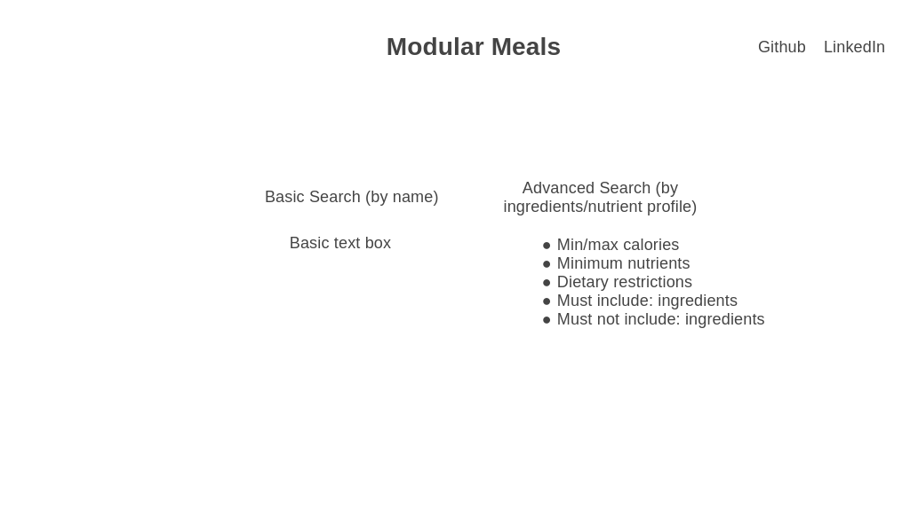
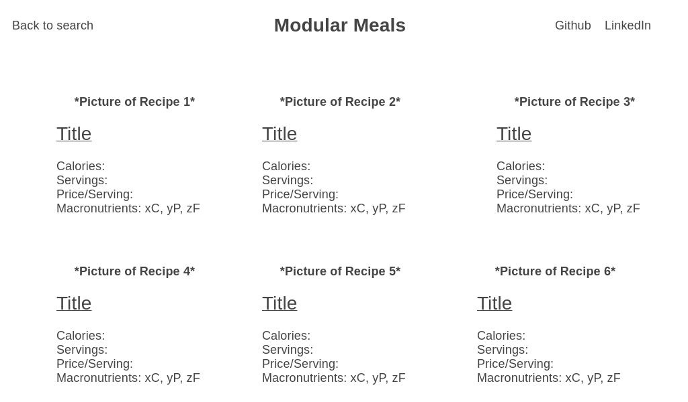

<u>Description:</u>

ModularMeals is a state-of-the-art culinary app designed for the health-conscious foodie. With its vast database of recipes and comprehensive nutrient analysis, users can customize meals to fit their specific dietary needs and goals. Built with JavaScript and leveraging both the *Edamam API*, the *USDA's FoodData Central*, and *chatGPT's API*, this application provides real-time updates to nutritional information as users adapt their recipes.

<u>Key Features:</u>

1. **Recipe Search:** Users can discover recipes by name or based on a specific nutrient profile, thanks to the integration with the *Edamam API*. A powerful search algorithm, built using JavaScript, ensures an efficient and relevant search experience.

2. **Recipe Nutritional Analysis:** ModularMeals provides a thorough breakdown of macro- and micronutrients for each recipe using USDA's FoodData Central. The nutritional information, including calories, carbohydrates, proteins, fats, fiber, vitamins, and minerals, is displayed in user-friendly pie charts, created with the *d3.js* library, and detailed lists. 

3. **Ingredient Nutritional Analysis:** Users can search for individual ingredients and study their nutritional profiles before making the decision to replace one of the recipe components.

4. **Dynamic Adjustment:** The app allows users to tailor recipes by modifying or removing ingredients. As changes are made, the app promptly recalculates the nutrient breakdown, ensuring the user is always aware of the nutritional content of their customized recipe.

5. **Substitution Suggestions:** Upon removal or alteration of an ingredient, ModularMeals queries *chatGPT's public API* and offers replacement suggestions that uphold the balance of taste and nutrients. This smart feature takes into account user's dietary needs, allergies, and preferences.

6. **Meal Balance Visualization:** A radar chart, also created using d3, can quantify how "balanced" a meal is by counting the number of servings of each food group (fruits, vegetables, proteins, oils & fats, grains).

ModularMeals uses JavaScript, a versatile and widely used programming language, to deliver a smooth user experience. It leverages three powerful APIs: the *Edamam API* for its extensive recipe database, and *USDA's FoodData Central* for comprehensive and reliable nutritional information, and *chatGPT* for ingredient replacement suggestions. This combination of technologies ensures that ModularMeals can cater to individuals with specific dietary preferences, exploratory cooks, or anyone keen on understanding the nutritional value of their meals.

Below are the three "pages" this application will have. The workflow on the app from the user's perspective is quite straightforward. On the home page, the user will query the *Edamam API* for recipes that match their search request:

 
    

From there, the user will see a brief overview of the nutritional information of each recipe, at which point they can select one to modify:

 
    

Once on the individual recipe's page, the user can see a detailed nutritional and food group breakdown, as well as modify the recipe by removing or replacing ingredients, modifying ingredient quantities, or asking for replacement suggestions for specific ingredients:

 
    

<u>Implementation Timeline</u>

- **Friday:** Figure out how to query the Edamam API and generate a series of recipes, incorporate different ways of querying the API using more advanced search methods
- **Weekend:** Parse out the data from the returned JSON and query the USDA Food Data API for more detailed nutritional information
- **Monday:** Use the d3.js library to create pie charts and a radar chart summarizing the recipe
- **Tuesday:** Allow users to modify recipes by removing or replacing individual ingredients
- **Wednesday:** Incorporate chatGPT's API to suggest ingredient replacements, CSS styling
